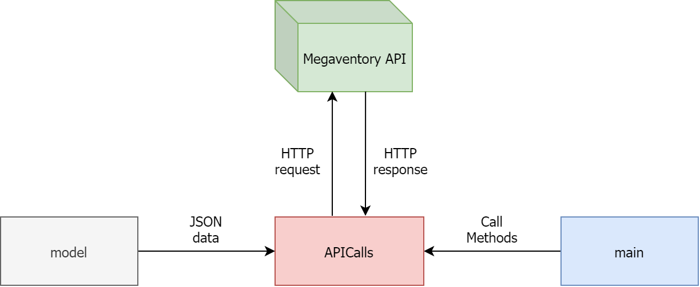

# Megaventory Mini App

A simple app to demonstrate Megaventory's API.

## About
This project is written in Java and all it does is just simple HTTP calls to Megaventory's API.  

The model consists of these 6 entities: 
* Product  
* Client  
* Warehouse  
* Tax  
* Discount  
* Sale

The "controller" is the class *APICalls.java*, and it does the HTTP POST calls to the API.  
The "frontend" is a Java main function, which is intializing the Objects and calling the controller's functions.

### In a Nutshell
I create the given objects on my own in the "main" method and then I call the appropriate fucntions of APICalls class. These functions are basically HTTP calls to the API, having the Objects' attributes as request body, with the appropriate JSON keys I spotted in the API's documentation. 
There's a method called *toJSON* in every Object's calss and it's job is to return the appropriate format to send in the request body.  

*Notes: Everything works fine except the Sales one (7), because I can't seem to find the appropriate permissions to call the method. However, the functionality is there and I really hope it works. Also, the API KEY is missing from github for obvious reasons. (BUT, I thought I had the key well protected in a file, but I only had it in a String inside the class. So, you may find it in the past commits and that's why after the evaluation, this project wil be private)*

You can see the flow of the app below: 

### Reference Project

There'a a simialr project in my CV, a Spring Boot app written mainly in Java, although it's a bit more complicated and well structured than this one. Feel free to visit this [link][1]!

[1]: https://github.com/PanagiotisNtymenos/OMDb-API-Web-Design "OMDb Spring Boot App"
